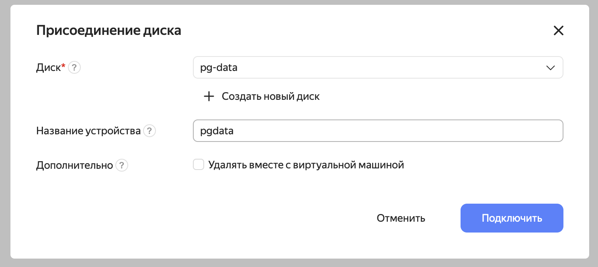

# Домашнее задание к уроку 6

### Создайте виртуальную машину c Ubuntu 20.04/22.04 LTS в GCE/ЯО/Virtual Box/докере
Виртуальную машину создал в Яндекс-облаке. 
```shell
% ssh -l alex 158.160.120.49
alex@pg-test:~$
...

```

### Поставьте на нее PostgreSQL 15 через sudo apt
Сначала обновил пакеты и систему:
```shell
alex@pg-test:~$ sudo apt-get update && sudo apt-get upgrade
```

В ubuntu 22.04 по-умолчанию устанавливается 14-я версия. Для текущего задания это не критично, поэтому не стал искать
15-ую версию в репозиториях.
```shell
alex@pg-test:~$ sudo apt-get install postgresql
```

### Проверьте что кластер запущен через sudo -u postgres pg_lsclusters
Создаю контейнер с клиентом и подключаюсь к контейнеру с сервером:
```shell
alex@pg-test:~$ sudo -u postgres pg_lsclusters
Ver Cluster Port Status Owner    Data directory              Log file
14  main    5432 online postgres /var/lib/postgresql/14/main /var/log/postgresql/postgresql-14-main.log 
```

### Зайдите из-под пользователя postgres в psql и сделайте произвольную таблицу с произвольным содержимым
```shell
alex@pg-test:~$ sudo -u postgres psql
psql (14.10 (Ubuntu 14.10-0ubuntu0.22.04.1))
Type "help" for help.
```

```postgresql
postgres=# create table test(c1 text);
CREATE TABLE
postgres=#  insert into test values('1');
INSERT 0 1
postgres=# select * from test;
 c1
----
 1
(1 row)

postgres=# \q
```

### Остановите postgres
```shell
alex@pg-test:~$ sudo -u postgres pg_ctlcluster 14 main stop
alex@pg-test:~$ sudo -u postgres pg_lsclusters
Ver Cluster Port Status Owner    Data directory              Log file
14  main    5432 down   postgres /var/lib/postgresql/14/main /var/log/postgresql/postgresql-14-main.log
```

### Создайте новый диск к ВМ размером 10GB
Промахнулся с размером, создал диск на 1GB, но для наших задач должно хватить.



### Проинициализируйте диск согласно инструкции
Смотрю на диски в системе:
```shell
alex@pg-test:~$ ls -l  /dev/disk/by-id/
total 0
lrwxrwxrwx 1 root root  9 Dec 24 15:30 virtio-fhm10mdcdcq78knluqfv -> ../../vda
lrwxrwxrwx 1 root root 10 Dec 24 15:30 virtio-fhm10mdcdcq78knluqfv-part1 -> ../../vda1
lrwxrwxrwx 1 root root 10 Dec 24 15:30 virtio-fhm10mdcdcq78knluqfv-part2 -> ../../vda2
lrwxrwxrwx 1 root root  9 Dec 24 15:39 virtio-pgdata -> ../../vdb
```

Инициализирую диск и файловую систему на нём:
```shell
alex@pg-test:~$ sudo parted /dev/vdb mklabel gpt
Information: You may need to update /etc/fstab.

alex@pg-test:~$ sudo parted -a opt /dev/vdb mkpart primary ext4 0% 100%
Information: You may need to update /etc/fstab.

alex@pg-test:~$ lsblk
NAME   MAJ:MIN RM   SIZE RO TYPE MOUNTPOINTS
loop0    7:0    0 111.9M  1 loop /snap/lxd/24322
loop1    7:1    0  63.3M  1 loop /snap/core20/1822
loop2    7:2    0  49.8M  1 loop /snap/snapd/18357
loop3    7:3    0  40.9M  1 loop /snap/snapd/20290
vda    252:0    0     8G  0 disk
├─vda1 252:1    0     1M  0 part
└─vda2 252:2    0     8G  0 part /
vdb    252:16   0     1G  0 disk
└─vdb1 252:17   0  1022M  0 part

alex@pg-test:~$ sudo mkfs.ext4 -L pgdata /dev/vdb1
mke2fs 1.46.5 (30-Dec-2021)
Creating filesystem with 261632 4k blocks and 65408 inodes
Filesystem UUID: 69b6b5d6-31bb-48f6-befc-46e48963d3cc
Superblock backups stored on blocks:
	32768, 98304, 163840, 229376

Allocating group tables: done
Writing inode tables: done
Creating journal (4096 blocks): done
Writing superblocks and filesystem accounting information: done

alex@pg-test:~$ sudo lsblk --fs
NAME   FSTYPE   FSVER LABEL  UUID                                 FSAVAIL FSUSE% MOUNTPOINTS
loop0  squashfs 4.0                                                     0   100% /snap/lxd/24322
loop1  squashfs 4.0                                                     0   100% /snap/core20/1822
loop2  squashfs 4.0                                                     0   100% /snap/snapd/18357
loop3  squashfs 4.0                                                     0   100% /snap/snapd/20290
vda
├─vda1
└─vda2 ext4     1.0          ed465c6e-049a-41c6-8e0b-c8da348a3577      3G    57% /
vdb
└─vdb1 ext4     1.0   pgdata 69b6b5d6-31bb-48f6-befc-46e48963d3cc
```

Создаю каталог `/mnt/data` и монтирую в него диск:
```shell
alex@pg-test:~$ sudo mkdir /mnt/data
alex@pg-test:~$ sudo mount -o defaults /dev/vdb1 /mnt/data/
```

Добавляю настройку в `/etc/fstab`, чтобы при перезагрузке диск подключался автоматом:
```shell
alex@pg-test:~$ ls -la /dev/disk/by-uuid/
total 0
drwxr-xr-x 2 root root  80 Dec 24 15:52 .
drwxr-xr-x 8 root root 160 Dec 24 15:52 ..
lrwxrwxrwx 1 root root  10 Dec 24 15:52 69b6b5d6-31bb-48f6-befc-46e48963d3cc -> ../../vdb1
lrwxrwxrwx 1 root root  10 Dec 24 15:50 ed465c6e-049a-41c6-8e0b-c8da348a3577 -> ../../vda2

alex@pg-test:~$ sudo vi /etc/fstab

alex@pg-test:~$ cat /etc/fstab
# /etc/fstab: static file system information.
#
# Use 'blkid' to print the universally unique identifier for a
# device; this may be used with UUID= as a more robust way to name devices
# that works even if disks are added and removed. See fstab(5).
#
# <file system> <mount point>   <type>  <options>       <dump>  <pass>
# / was on /dev/vda2 during curtin installation
/dev/disk/by-uuid/ed465c6e-049a-41c6-8e0b-c8da348a3577 / ext4 defaults 0 1
/dev/disk/by-uuid/69b6b5d6-31bb-48f6-befc-46e48963d3cc /mnt/data ext4 defaults 0 1
```

### Перезагрузите инстанс и убедитесь, что диск остается примонтированным
Перезагружаю систему:
```shell
alex@pg-test:~$ sudo reboot
Connection to 158.160.120.49 closed by remote host.
Connection to 158.160.120.49 closed.
```

Через некоторое время подключаюсь и смотрю на подключённые диски:
```shell
% ssh -l alex 158.160.120.49

alex@pg-test:~$ sudo lsblk
NAME   MAJ:MIN RM   SIZE RO TYPE MOUNTPOINTS
loop0    7:0    0  63.3M  1 loop /snap/core20/1822
loop1    7:1    0 111.9M  1 loop /snap/lxd/24322
loop2    7:2    0  49.8M  1 loop /snap/snapd/18357
loop3    7:3    0  40.9M  1 loop /snap/snapd/20290
vda    252:0    0     8G  0 disk
├─vda1 252:1    0     1M  0 part
└─vda2 252:2    0     8G  0 part /
vdb    252:16   0     1G  0 disk
└─vdb1 252:17   0  1022M  0 part /mnt/data
```

Диск на месте, примонтирован.

### Сделайте пользователя postgres владельцем /mnt/data
```shell
alex@pg-test:~$ sudo chown -R postgres:postgres /mnt/data/
```

### Перенесите содержимое /var/lib/postgres
Останавливаю кластер:
```shell
alex@pg-test:~$ sudo -u postgres pg_ctlcluster 14 main stop
```
Переношу файлы:
```shell
alex@pg-test:~$ sudo mv /var/lib/postgresql/14 /mnt/data/
alex@pg-test:~$ sudo ls -l /mnt/data/14/main/
total 80
-rw------- 1 postgres postgres    3 Dec 24 15:35 PG_VERSION
drwx------ 5 postgres postgres 4096 Dec 24 15:35 base
drwx------ 2 postgres postgres 4096 Dec 24 16:00 global
drwx------ 2 postgres postgres 4096 Dec 24 15:35 pg_commit_ts
drwx------ 2 postgres postgres 4096 Dec 24 15:35 pg_dynshmem
drwx------ 4 postgres postgres 4096 Dec 24 16:08 pg_logical
drwx------ 4 postgres postgres 4096 Dec 24 15:35 pg_multixact
drwx------ 2 postgres postgres 4096 Dec 24 15:35 pg_notify
drwx------ 2 postgres postgres 4096 Dec 24 15:35 pg_replslot
drwx------ 2 postgres postgres 4096 Dec 24 15:35 pg_serial
drwx------ 2 postgres postgres 4096 Dec 24 15:35 pg_snapshots
drwx------ 2 postgres postgres 4096 Dec 24 16:08 pg_stat
drwx------ 2 postgres postgres 4096 Dec 24 15:35 pg_stat_tmp
drwx------ 2 postgres postgres 4096 Dec 24 15:35 pg_subtrans
drwx------ 2 postgres postgres 4096 Dec 24 15:35 pg_tblspc
drwx------ 2 postgres postgres 4096 Dec 24 15:35 pg_twophase
drwx------ 3 postgres postgres 4096 Dec 24 15:35 pg_wal
drwx------ 2 postgres postgres 4096 Dec 24 15:35 pg_xact
-rw------- 1 postgres postgres   88 Dec 24 15:35 postgresql.auto.conf
-rw------- 1 postgres postgres  130 Dec 24 15:59 postmaster.opts
```

### Попытайтесь запустить кластер
Запускаю кластер и получаю ошибку:
```shell
alex@pg-test:~$ sudo -u postgres pg_ctlcluster 14 main start
Error: /var/lib/postgresql/14/main is not accessible or does not exist
```

Что логично: файлов нет, я же их только что утащил в другой каталог.

### Задание: найти конфигурационный параметр
Изменился путь, поэтому в конфигурационных файлах буду искать его:
```shell
alex@pg-test:~$ sudo find /etc/postgresql/14/main -type f -exec grep -n -H '/var/lib/postgresql' {} \;
/etc/postgresql/14/main/postgresql.conf:data_directory = '/var/lib/postgresql/14/main'		# use data in another directory
```

То, что нужно; исправляю параметр `data_directory` в `/etc/postgresql/14/main/postgresql.conf` на корректный путь,
куда я недавно перенёс файлы:
```shell
alex@pg-test:~$ sudo vi /etc/postgresql/14/main/postgresql.conf

alex@pg-test:~$ sudo cat /etc/postgresql/14/main/postgresql.conf | grep data_directory
data_directory = '/mnt/data/14/main'		# use data in another directory
```

### Попытайтесь запустить кластер
Запускаю кластер и смотрю на его статус:
```shell
alex@pg-test:~$ sudo -u postgres pg_ctlcluster 14 main start
sudo systemctl start postgresql@14-main
alex@pg-test:~$ sudo -u postgres pg_lsclusters
Ver Cluster Port Status Owner    Data directory    Log file
14  main    5432 online postgres /mnt/data/14/main /var/log/postgresql/postgresql-14-main.log
```

Всё корректно запустилось: файлы СУБД нашла, права доступа есть.

### Зайдите через через psql и проверьте содержимое ранее созданной таблицы
```postgresql
alex@pg-test:~$ sudo -u postgres psql
psql (14.10 (Ubuntu 14.10-0ubuntu0.22.04.1))
Type "help" for help.

postgres=# select * from test;
 c1
----
 1
(1 row)

postgres=# \q
```

### Задание со звездочкой
Создал новую виртуальную машину. Чтобы подключить диск к новой ВМ нужно было остановить (не удалять) предыдущую ВМ,
отключить диск от неё, и уже потом появилась возможность подключить диск к новой ВМ.

Подключаюсь в новой ВМ:
```shell
 % ssh -l alex 158.160.99.66
The authenticity of host '158.160.99.66 (158.160.99.66)' can't be established.
ED25519 key fingerprint is SHA256:m6fY6gGqQ+cWfwbIvJdQAe/zsTFYjgq42dcCj5lOiWs.
This key is not known by any other names.
Are you sure you want to continue connecting (yes/no/[fingerprint])? yes
Warning: Permanently added '158.160.99.66' (ED25519) to the list of known hosts.
Welcome to Ubuntu 22.04.3 LTS (GNU/Linux 5.15.0-91-generic x86_64)
```

Обновляю и устанавливаю PostgreSQL
```shell
alex@pg-next:~$ sudo apt-get update && sudo apt-get upgrade
alex@pg-next:~$ sudo apt-get install postgresql
alex@pg-next:~$ sudo -u postgres pg_lsclusters
Ver Cluster Port Status Owner    Data directory              Log file
14  main    5432 online postgres /var/lib/postgresql/14/main /var/log/postgresql/postgresql-14-main.log
```

Останавливаю кластер и удаляю все файлы кластера из `/var/lib/postgresql`.:
```shell
alex@pg-next:~$ sudo -u postgres pg_ctlcluster 14 main stop
alex@pg-next:~$ rm -r /var/lib/postgresql/14/
```

Строго говоря, это делать не обязательно, так как при монтировании в каталог текущие файлы будут перекрыты, но для
чистоты эксперимента удалил.

Монтирую диск с данными от первой ВМ:
```shell
alex@pg-next:~$ sudo lsblk
NAME   MAJ:MIN RM   SIZE RO TYPE MOUNTPOINTS
loop0    7:0    0  63.3M  1 loop /snap/core20/1822
loop1    7:1    0 111.9M  1 loop /snap/lxd/24322
loop2    7:2    0  49.8M  1 loop /snap/snapd/18357
vda    252:0    0     8G  0 disk
├─vda1 252:1    0     1M  0 part
└─vda2 252:2    0     8G  0 part /
vdb    252:16   0     1G  0 disk
└─vdb1 252:17   0  1022M  0 part


alex@pg-next:~$ sudo mount -o defaults /dev/vdb1 /var/lib/postgresql/

alex@pg-next:~$ ls -l /var/lib/postgresql/
total 20
drwxr-xr-x 3 postgres postgres  4096 Dec 24 15:35 14
drwx------ 2 postgres postgres 16384 Dec 24 15:52 lost+found
```

Файлы появились. Идентификатор пользователя и группы совпал, поэтому владельца переназначать не надо.
Просто запускаю кластер:
```shell
alex@pg-next:~$ sudo -u postgres pg_ctlcluster 14 main start

alex@pg-next:~$ sudo -u postgres pg_lsclusters
Ver Cluster Port Status Owner    Data directory              Log file
14  main    5432 online postgres /var/lib/postgresql/14/main /var/log/postgresql/postgresql-14-main.log
```

Кластер успешно запустился. Проверяю, что данные на месте:
```postgresql
alex@pg-next:~$ sudo -u postgres psql
could not change directory to "/home/alex": Permission denied
psql (14.10 (Ubuntu 14.10-0ubuntu0.22.04.1))
Type "help" for help.

postgres=# select * from test;
 c1
----
 1
(1 row)

postgres=# \q
```

Работает!
